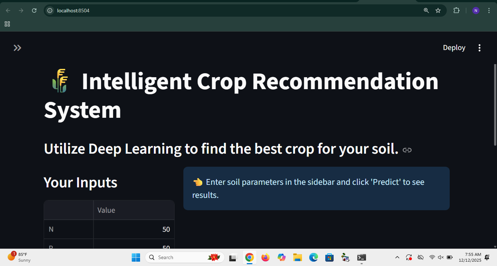
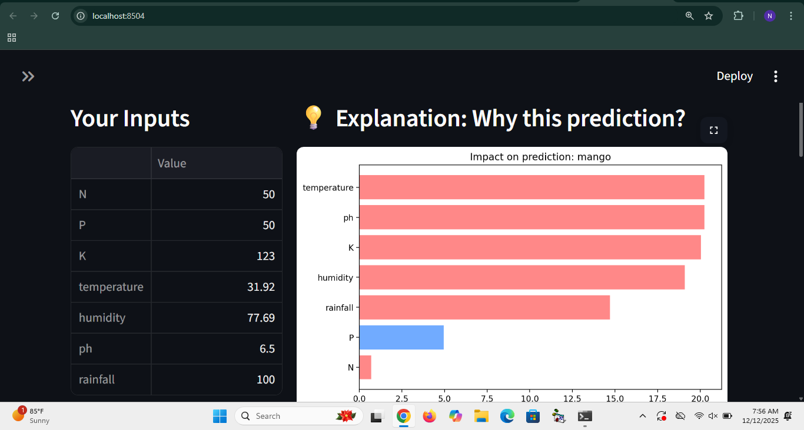
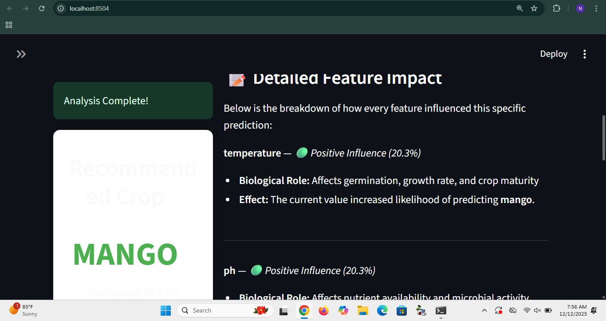

 🌾 Intelligent Crop Recommendation System

**Bringing the power of Artificial Intelligence to agriculture.**

---

## 📖 Table of Contents

* [Problem Statement](#problem-statement)
* [What the App Does](#what-the-app-does)
* [Solution](#solution)
* [Challenges I Overcame](#challenges-we-overcame)
* [Technologies & Requirements](#technologies--requirements)
* [How to Run Locally](#how-to-run-locally)
* [About Me](#about-me)

---

## 🚩 Problem Statement

Agriculture is becoming increasingly data-driven, yet many farmers and planners lack easy-to-use tools to interpret complex soil and climate information. Selecting the wrong crop for a given environment can result in:

* **Lower yields** and financial losses.
* **Soil degradation** due to nutrient imbalances.
* **Inefficient resource use**, including water and fertilizers.

Traditional approaches often rely on intuition or generic guidelines, ignoring the subtle interplay between soil nutrients (N, P, K) and climatic factors.

---

## 📱 What the App Does

This **interactive decision-support tool** recommends the most suitable crop to grow based on your soil and environmental data.




Beyond simple predictions, the app uses **Explainable AI (XAI)** to show *why* a particular crop is recommended, highlighting the biological and environmental impact of each factor.

---

## 💡 Solution

I developed a **deep learning-based classification system** with a user-friendly interface:

1. **Deep Learning Core:** A custom PyTorch Feed-Forward Neural Network analyzes patterns across 7 key agricultural features.
2. **Interactive Dashboard:** Built with Streamlit, it allows users to input soil and climate data via sliders and receive instant, interpretable recommendations.
3. **Transparency with SHAP:** SHAP values visualize feature importance, explaining, for example, *“High rainfall positively influenced the recommendation for Rice.”*

   

---

## 🧗 Challenges I Overcame

Developing this system involved solving several technical and design challenges:

* **Model Explainability:** Translating deep learning predictions into human-understandable insights with SHAP.
  

* **User Experience:** Implementing a “Smart Reset” to prevent old predictions from persisting when inputs change.
* **Data Balancing:** Ensuring the model fairly represents both common and niche crops through careful preprocessing and scaling.

---

## 🛠 Technologies & Requirements

| Category            | Technology                           |
| ------------------- | ------------------------------------ |
| **Language**        | Python 3.x                           |
| **Frontend**        | Streamlit                            |
| **Deep Learning**   | PyTorch (`torch`, `torch.nn`)        |
| **Data Processing** | Pandas, NumPy, Scikit-learn          |
| **Explainability**  | SHAP (SHapley Additive exPlanations) |
| **Visualization**   | Matplotlib, Seaborn                  |

**Dependencies:** All required packages are listed in `requirements.txt`.

---

## 🚀 How to Run Locally

Follow these steps to get the app running on your machine:

1. **Clone the Repository**

```bash
git clone https://github.com/CodeWithNafisat/Crop-Recommendation-System.git
cd Crop-Recommendation-System
```

2. **Create a Virtual Environment (Recommended)**

```bash
# Windows
python -m venv venv
venv\Scripts\activate

# Mac/Linux
python3 -m venv venv
source venv/bin/activate
```

3. **Install Dependencies**

```bash
pip install -r requirements.txt
```

> Ensure the files `best_model.pth`, `scaler.pkl`, `le.pkl`, and `bg.csv` are in the project root.

4. **Run the App**

```bash
streamlit run app.py
```

5. **Access the App**
   Open your browser at: `http://localhost:8501`

---

## 👩‍💻 About Me

**Nafisat Abdulraheem** – passionate about building **AI tools that are practical, interpretable, and impactful**.

* **GitHub:** [CodeWithNafisat](https://github.com/CodeWithNafisat)
* **LinkedIn:** [Nafisat Abdulraheem](https://www.linkedin.com/in/nafisat-abdulraheem-7a193b337)

---

## 📄 License

This project is licensed under the **MIT License** – see the LICENSE file for details.

---
